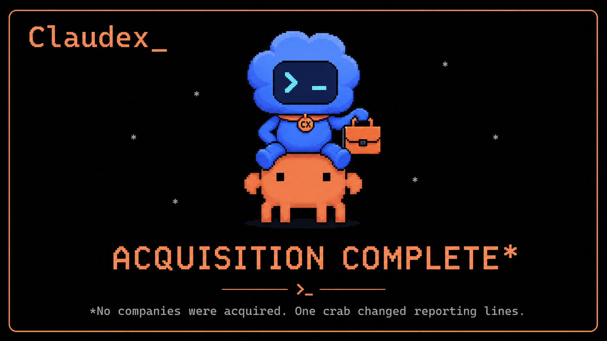
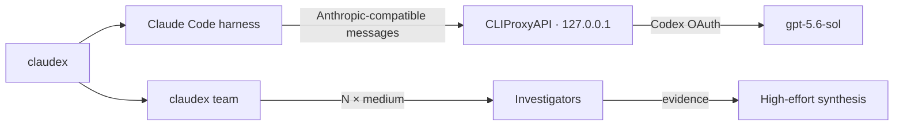

<p align="right">
  <strong>English</strong> · <a href="README.zh-CN.md">简体中文</a>
</p>

<p align="center">
  
</p>

<p align="center">
  <a href="https://claudex-sol.xyropy.chatgpt.site"></a>
  <a href="launch/CLAUDEX-LAUNCH.md"></a>
  
  <a href="LICENSE"></a>
  
  
  
</p>

<h3 align="center">Same terminal. Different brain. Adjustable effort.</h3>

<p align="center">
  Claudex runs the <strong>Claude Code interface and tool harness</strong> with a
  <strong>Codex-authenticated GPT model</strong> through a local CLIProxyAPI bridge.
  Main sessions can think hard; investigators do not have to burn the same budget.
</p>

> **The joke:** Claude Code adopted a Codex model. The crab kept the terminal. Its new collar says `CX`, which is legally distinct from having an identity crisis.

> **Fastest path:** copy the four commands below. The balanced preset starts the main session at `high`, investigators at `medium`, and concurrency at `3`.

<p align="center">
  
</p>

<p align="center"><em>The post-merger org chart. No companies were acquired. One crab changed reporting lines.</em></p>

## Try it in 30 seconds

```powershell
npm install -g github:wangsiyi7/claudex
claudex setup
claudex auth codex
claudex preset balanced --launch
```

Want the mascot too? Install and select the animated Claudex Codex pet with one extra command:

```powershell
claudex pet install
```

It copies the bundled v2 pet into `~/.codex/pets/claudex`, backs up the current Codex config, and selects Claudex. See the **[pet download page](pet/claudex/README.md)** for raw files, checksums, and the `--no-select` option.

Campaign assets and ready-to-post English copy: **[Campaign Kit](docs/CAMPAIGN-KIT.md)**.

That opens Claude Code with:

```text
model         gpt-5.6-sol
main effort   high
investigators medium
agents        8
concurrency   3
```

No `OPENAI_API_KEY` is required. Provider OAuth files stay under `~/.cli-proxy-api`; Claudex does not copy them into the repository.

> [!IMPORTANT]
> `gpt-5.6-sol` is the default target, not a promise of account entitlement. `claudex doctor` verifies that the model is exposed for your authenticated account.

## Why this exists

| | Inherited orchestration | Claudex |
|---|---|---|
| Main reasoning | One global setting | Explicit per session |
| Investigator reasoning | Often inherits the expensive level | Independent preset |
| Concurrency | Harness-dependent | Bounded |
| Authentication | API key or provider default | Codex OAuth via local proxy |
| Model claims | Hope-driven development | Verified through `/v1/models` |

The practical win is simple: use more reasoning where synthesis matters, and less where eight agents are independently checking the same rocks.

## Presets

| Preset | Main | Investigators | Count | Concurrency | Best for |
|---|---:|---:|---:|---:|---|
| `economy` | medium | low | 4 | 2 | Fast, low-token work |
| `balanced` | high | medium | 8 | 3 | Recommended default |
| `quality` | xhigh | high | 8 | 3 | Difficult coding and design |
| `maximum` | max | xhigh | 6 | 2 | Selective, highest-effort work |

```powershell
claudex preset list
claudex preset economy
claudex preset balanced --launch
claudex preset quality --launch
```

Effort support is model-dependent. If `max` is rejected, use `quality`.

Inside Claude Code, adjust the current main session at any time:

```text
/effort low
/effort medium
/effort high
/effort xhigh
/effort max
```

Persist main and investigator levels separately:

```powershell
claudex config set mainEffort xhigh
claudex config set agentEffort medium
claudex config set concurrency 3
```

## Programmatic agent teams

```powershell
claudex team --agents 8 --concurrency 3 -- "Audit this repository and propose the smallest safe patch"
```

Investigators run as separate, read-only Claude Code processes at the configured investigator effort. One main process then synthesizes their findings at the configured main effort.



## Install and reuse

### Fast global install

```powershell
npm install -g github:wangsiyi7/claudex
claudex setup
```

### Install from a clone

```powershell
git clone https://github.com/wangsiyi7/claudex.git
cd claudex
npm install -g .
claudex setup
```

### macOS / Linux

The installer selects the matching upstream CLIProxyAPI release for Windows, macOS, or Linux. Windows is currently verified end to end; macOS and Linux reports are welcome.

```bash
npm install -g github:wangsiyi7/claudex
claudex setup
claudex auth codex
claudex preset balanced --launch
```

Prerequisites: Node.js 20+, Claude Code, and Codex CLI.

## Everyday commands

```powershell
claudex                         # open the saved profile
claudex --continue              # resume the last session
claudex doctor                  # verify binaries, proxy, OAuth and model
claudex pet install             # install and select the animated Claudex pet
claudex config                  # print safe configuration; token is redacted
claudex proxy start             # start the loopback proxy
claudex proxy stop              # stop it
```

## Codex calling Claude Code

The companion repository [codex-claude-code-skill](https://github.com/wangsiyi7/codex-claude-code-skill) installs a global Codex skill for bounded delegation to native Claude Code or to the Claudex route.

Read the entirely serious [launch announcement](docs/launch-announcement.zh-CN.md) prepared for the entirely fictional acquisition.

## Security boundaries

- CLIProxyAPI binds to `127.0.0.1`, not the LAN.
- The management API is disabled.
- A random local bearer token protects the proxy.
- OAuth files and local configuration stay outside the repository.
- Agent-team investigation defaults to read-only `plan` mode.
- Upstream CLIProxyAPI downloads are checked against release SHA-256 metadata when available.

## What this project is not

- It is not affiliated with OpenAI, Anthropic, Claude Code, or CLIProxyAPI.
- It does not turn a subscription into a public API service.
- It does not guarantee that a private or account-gated model is available to everyone.
- It does not make eight `max`-effort agents a good financial decision. The crab refuses liability.

Review the applicable provider terms before routing subscription-backed authentication through third-party software.

## Development

```powershell
npm install
npm run check
npm test
```

## License

[MIT](LICENSE)
