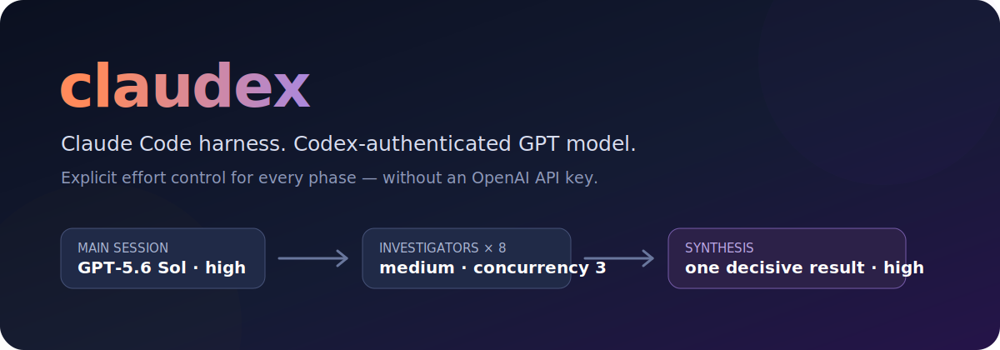
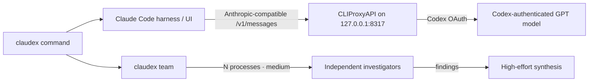

<p align="center">
  
</p>

<p align="center">
  <a href="https://github.com/wangsiyi7/claudex/actions/workflows/ci.yml"></a>
  <a href="LICENSE"></a>
  
  
</p>

<p align="center">
  <strong>Keep Claude Code's interface and tools. Run a Codex-authenticated GPT model inside it.</strong><br>
  Right-size investigator effort programmatically instead of letting every subagent inherit the most expensive setting.
</p>

<p align="center">
  <a href="#two-minute-setup">Setup</a> ·
  <a href="#token-efficient-agent-teams">Agent teams</a> ·
  <a href="#how-it-works">Architecture</a> ·
  <a href="#security-boundaries">Security</a>
</p>

## Why claudex?

| | Plain inherited orchestration | claudex team |
|---|---|---|
| Main reasoning | One global setting | `high` by default |
| Investigator reasoning | Often inherits main | Explicit `medium` |
| Concurrency | Harness-dependent | Bounded; default `3` |
| Provider access | API key or native provider | Codex OAuth through CLIProxyAPI |
| Verification | Easy to assume a model exists | `/v1/models` checked by `claudex doctor` |

`claudex` packages the workflow demonstrated in Theo's July 2026 experiment into a reproducible command-line tool:

- an interactive Claude Code session targeting `gpt-5.6-sol` at `high` effort;
- independent investigators launched at `medium` effort;
- a single high-effort synthesis pass;
- a loopback-only proxy and local OAuth credential storage;
- no `OPENAI_API_KEY`.

> [!IMPORTANT]
> `gpt-5.6-sol` is the default target, not a promise of account entitlement. Run `claudex doctor`; if the model is not returned for your authenticated account, select an ID that is.

## Two-minute setup

### Prerequisites

- Node.js 20+
- Claude Code and Codex CLI installed
- a Codex account entitled to the model you select

### Windows

```powershell
git clone https://github.com/wangsiyi7/claudex.git
cd claudex
npm install -g .

claudex setup
claudex auth codex
claudex proxy start
claudex doctor
claudex
```

Add the reverse Claude OAuth route when you want CLIProxyAPI to expose both providers:

```powershell
claudex auth claude
```

The OAuth commands open each provider's browser flow. CLIProxyAPI stores provider auth under `~/.cli-proxy-api`; claudex never reads or copies those credential files.

## Token-efficient agent teams

```powershell
claudex team --agents 8 --concurrency 3 -- "Audit this repository and propose the smallest safe patch"
```

Eight isolated investigators run in read-only plan mode at `medium` effort, in waves of at most three. Their findings are passed to one `high`-effort synthesis call.

Override the defaults when a task deserves a different budget:

```powershell
claudex team `
  --agents 4 `
  --concurrency 2 `
  --agent-effort low `
  --main-effort high `
  -- "Compare these two implementation strategies"
```

## How it works



For the current invocation, the interactive wrapper sets the proxy URL, a locally generated bearer token, the custom model option, the subagent model, bounded tool concurrency, and disabled proxy tool search. It then launches:

```text
claude --model gpt-5.6-sol --effort high
```

Normal Claude Code arguments pass through unchanged:

```powershell
claudex --continue
claudex --permission-mode plan
```

The screenshot-derived `CLAUDE_CODE_ALWAYS_ENABLE_EFFORT` and `CLAUDE_CODE_MAX_TOOL_USE_CONCURRENCY` variables remain as compatibility hints. The deterministic controls are Claude Code's `--effort`, `CLAUDE_CODE_SUBAGENT_MODEL`, and the explicit per-process effort used by `claudex team`.

## Configuration

```powershell
claudex config
claudex config set model gpt-5.6-sol
claudex config set mainEffort high
claudex config set agentEffort medium
claudex config set concurrency 3
```

Local configuration lives under `~/.claudex/`. It contains a random token for the loopback proxy and must never be committed.

## Diagnostics

```powershell
claudex doctor
```

The doctor checks:

1. Claude Code and Codex CLI availability;
2. the installed CLIProxyAPI binary;
3. local proxy health;
4. OAuth-backed model discovery;
5. whether the configured model is actually available.

If the target is unavailable:

```powershell
claudex config set model <available-model-id>
```

## Security boundaries

- The proxy binds to `127.0.0.1`, not the LAN.
- The management API is disabled.
- The local proxy token and OAuth files stay outside this repository.
- Agent-team investigation uses read-only `plan` permission mode.
- Downloads come from the upstream CLIProxyAPI GitHub release and are checked against the release SHA-256 digest when provided.

This is an independent community project, not an OpenAI, Anthropic, Claude Code, or CLIProxyAPI product. Review the applicable provider terms before routing subscription-backed authentication through third-party software.

## License

[MIT](LICENSE)
