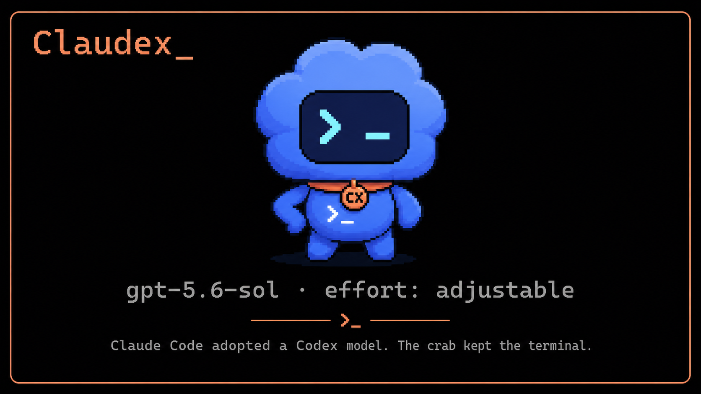
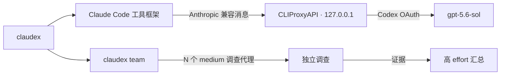

<p align="right">
  <a href="README.md">English</a> · <strong>简体中文</strong>
</p>

<p align="center">
  
</p>

<p align="center">
  
  <a href="LICENSE"></a>
  
  
  
</p>

<h3 align="center">壳还是那个壳，脑子可以换，努力程度还能拧旋钮。</h3>

<p align="center">
  Claudex 保留 <strong>Claude Code 的界面与工具系统</strong>，
  通过本地 CLIProxyAPI 使用 <strong>Codex OAuth 认证的 GPT 模型</strong>。
  主代理可以认真想，八个调查代理没必要一起烧到最高档。
</p>

> **本项目的笑点：** Claude Code 收养了一个 Codex 模型。小螃蟹坚持留下终端，还戴上了写着 `CX` 的项圈——这绝对不是身份危机，只是跨平台协作。

## 30 秒开始使用

```powershell
npm install -g github:wangsiyi7/claudex
claudex setup
claudex auth codex
claudex preset balanced --launch
```

启动后的默认配置：

```text
模型          gpt-5.6-sol
主会话 effort high
调查代理      medium
代理数量      8
最大并发      3
```

不需要 `OPENAI_API_KEY`。服务商 OAuth 文件保存在 `~/.cli-proxy-api`，Claudex 不会把它们复制进项目仓库。

> [!IMPORTANT]
> `gpt-5.6-sol` 是默认目标，不代表所有账户都具备权限。运行 `claudex doctor` 会验证你的已认证账户是否实际暴露该模型。

## 为什么要做 Claudex

| | 全部继承的编排 | Claudex |
|---|---|---|
| 主代理推理 | 一个全局档位 | 每次会话独立指定 |
| 调查代理推理 | 经常继承最昂贵档位 | 单独设置预设 |
| 并发 | 由执行框架决定 | 明确限制 |
| 认证 | API Key 或服务商默认 | 本地代理中的 Codex OAuth |
| 模型可用性 | 先相信，报错再说 | 通过 `/v1/models` 验证 |

核心收益很简单：把推理预算用在真正需要综合判断的地方，而不是让八个代理用最高档一起检查同一块石头。

## 快速预设

| 预设 | 主代理 | 调查代理 | 数量 | 并发 | 适用场景 |
|---|---:|---:|---:|---:|---|
| `economy` | medium | low | 4 | 2 | 快速、省 token |
| `balanced` | high | medium | 8 | 3 | 推荐日常默认值 |
| `quality` | xhigh | high | 8 | 3 | 困难编码与设计任务 |
| `maximum` | max | xhigh | 6 | 2 | 少量、最高强度任务 |

```powershell
claudex preset list
claudex preset economy
claudex preset balanced --launch
claudex preset quality --launch
```

effort 支持范围取决于模型。如果网关拒绝 `max`，请改用 `quality`。

进入 Claude Code 后，可以随时调整当前主会话：

```text
/effort low
/effort medium
/effort high
/effort xhigh
/effort max
```

主代理与调查代理也可以分别持久化设置：

```powershell
claudex config set mainEffort xhigh
claudex config set agentEffort medium
claudex config set concurrency 3
```

## 程序化代理团队

```powershell
claudex team --agents 8 --concurrency 3 -- "审计这个仓库，并提出最小且安全的补丁"
```

调查代理会作为相互独立、只读的 Claude Code 进程运行，使用调查代理 effort；随后由一个主进程按照主会话 effort 汇总证据。



## 安装与复用

### 快速全局安装

```powershell
npm install -g github:wangsiyi7/claudex
claudex setup
```

### 从仓库安装

```powershell
git clone https://github.com/wangsiyi7/claudex.git
cd claudex
npm install -g .
claudex setup
```

### macOS / Linux

安装器会根据 Windows、macOS 或 Linux 自动选择相应的 CLIProxyAPI 上游发行包。目前 Windows 已完成端到端验证，欢迎提交 macOS 与 Linux 的使用反馈。

```bash
npm install -g github:wangsiyi7/claudex
claudex setup
claudex auth codex
claudex preset balanced --launch
```

前置要求：Node.js 20+、Claude Code 和 Codex CLI。

## 常用命令

```powershell
claudex                         # 使用已保存的预设启动
claudex --continue              # 继续最近一次会话
claudex doctor                  # 检查程序、代理、OAuth 与模型
claudex config                  # 显示安全配置；token 会自动隐藏
claudex proxy start             # 启动本地代理
claudex proxy stop              # 停止本地代理
```

## 让 Codex 调用 Claude Code

配套仓库 [codex-claude-code-skill](https://github.com/wangsiyi7/codex-claude-code-skill) 可以安装一个全局 Codex Skill，让 Codex 在明确边界内调用原生 Claude Code 或 Claudex 路由。

## 安全边界

- CLIProxyAPI 只绑定 `127.0.0.1`，不会监听局域网。
- 管理 API 默认关闭。
- 本地代理使用随机生成的 bearer token。
- OAuth 文件和本地配置不会进入仓库。
- 代理团队调查默认使用只读 `plan` 模式。
- 如果上游发行版提供 SHA-256 元数据，下载后会自动校验。

## 这个项目不是什么

- 不是 OpenAI、Anthropic、Claude Code 或 CLIProxyAPI 官方项目。
- 不会把个人订阅变成公共 API 服务。
- 不保证所有人都能使用私有或账户受限模型。
- 也不保证同时运行八个 `max` 代理是明智的财务决策。小螃蟹拒绝承担责任。

使用第三方软件转发订阅认证前，请自行检查相应服务商条款。

## 开发

```powershell
npm install
npm run check
npm test
```

## 许可证

[MIT](LICENSE)
