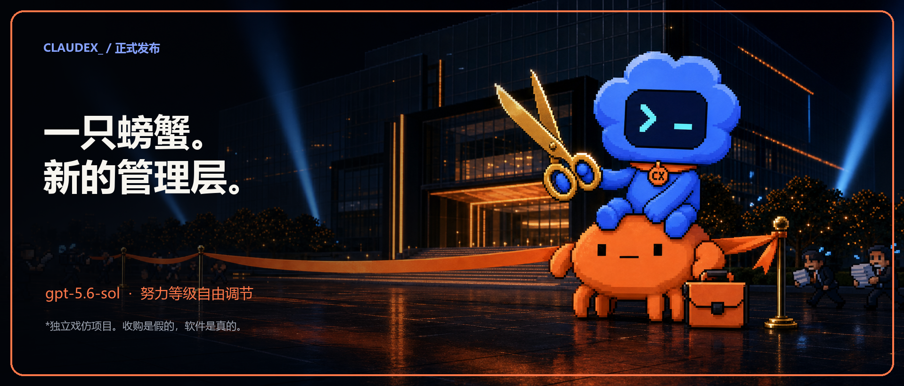
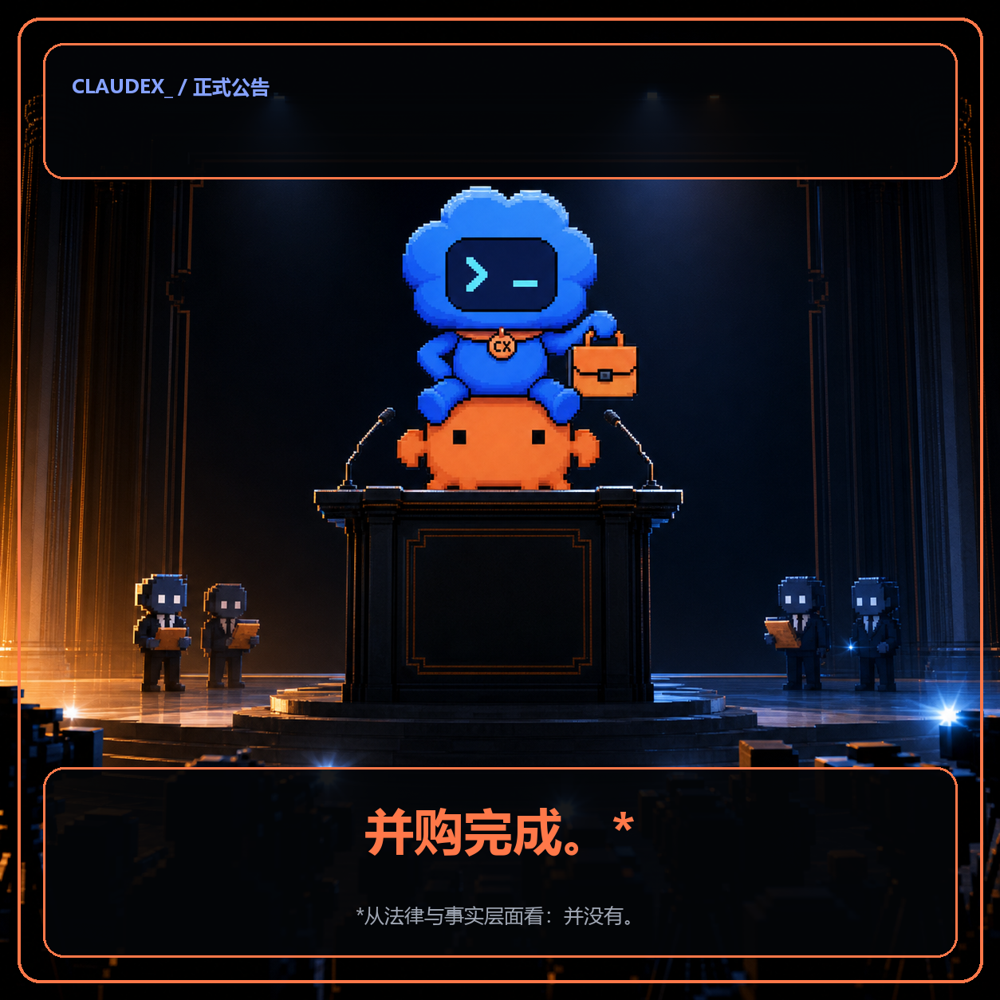
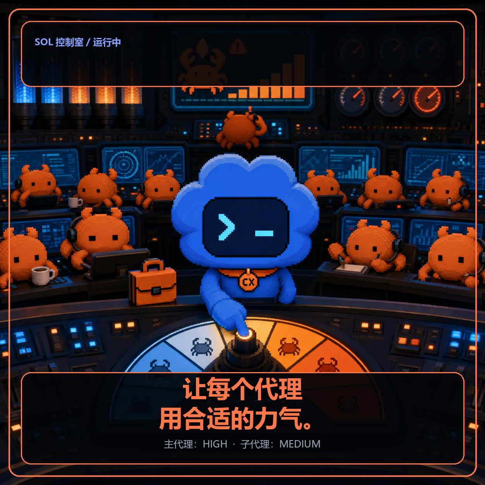

# Claudex Campaign Kit

Everything below is ready to publish. The acquisition language is parody; the software, repository, and launch site are real.

## X thread — English

### Post 1 — launch

Image: [`assets/claudex-x-launch.png`](../assets/claudex-x-launch.png)

> Today we acquired @AnthropicAI + @OpenAI.*
>
> Introducing Claudex: Claude Code's shell, Codex's brain, and one crab's rapidly changing reporting line.
>
> *We did not. Independent parody project.
>
> https://claudex-sol.xyropy.chatgpt.site

### Post 2 — product

Image: [`assets/campaign/en/claudex-press-conference.png`](../assets/campaign/en/claudex-press-conference.png)

> The acquisition is fictional. The software is real.
>
> Claudex launches Claude Code with a Codex-authenticated GPT model through a local bridge. Default target: gpt-5.6-sol.
>
> GitHub: https://github.com/wangsiyi7/claudex

### Post 3 — orchestration

Image: [`assets/campaign/en/claudex-effort-control.png`](../assets/campaign/en/claudex-effort-control.png)

> Why build it? Right-sized orchestration.
>
> Main session: high.  
> Investigators: medium.  
> Concurrency: bounded.  
> Token bonfire: optional.
>
> The crab remains fully operational under new management.

### Post 4 — install

Image: [`assets/campaign/en/claudex-wechat-cover.png`](../assets/campaign/en/claudex-wechat-cover.png)

> Available now. Four commands. Zero acquisition financing.
>
> npm install -g github:wangsiyi7/claudex  
> claudex setup  
> claudex auth codex  
> claudex preset balanced --launch
>
> Docs + live demo: https://claudex-sol.xyropy.chatgpt.site

---

## 公众号版本 — 中文

### 标题

今天，我们正式收购了 Anthropic 和 OpenAI。并没有。

### 摘要

Claude Code 的壳，Codex 的脑，外加一只刚刚更换管理层的小螃蟹。我们隆重推出 Claudex：一个真正能运行、支持 `gpt-5.6-sol`、并可独立调节代理努力等级的独立戏仿项目。

### 封面



### 正文

今天，我们非常荣幸地宣布：我们正式收购了 Anthropic 和 OpenAI。*

这项具有里程碑意义的交易，把 Claude Code 的终端、工具和那只耐心到令人不安的小螃蟹，与 Codex 的认证、GPT 模型和一只明显晋升过快的蓝色终端宠物，正式放进了同一张组织架构图。

由此，我们隆重推出 **Claudex**。



Claudex 保留 Claude Code 的操作界面与工具体系，通过本地 CLIProxyAPI 桥接使用 Codex 账户已认证的模型能力。默认目标是 `gpt-5.6-sol`，不需要额外填写 OpenAI API Key，也不要求先登录 Claude 才能启动已经配置好的工作流。

更重要的是，它允许你决定整个组织到底需要多努力：

- 主代理可以使用 `high` 或 `xhigh`，负责真正困难的决策；
- 调查型子代理可以保持 `medium`，负责搜索、验证和并行研究；
- 并发数量可以限制；
- 工具搜索可以调整；
- token 篝火晚会终于从必选项变成了可选项。



最快的使用方式只有四步：

```powershell
npm install -g github:wangsiyi7/claudex
claudex setup
claudex auth codex
claudex preset balanced --launch
```

项目主页：<https://claudex-sol.xyropy.chatgpt.site>  
GitHub：<https://github.com/wangsiyi7/claudex>

我们相信，软件开发的未来属于多模型、本地编排、可调节努力等级，以及一只职责边界尚未完全明确的小螃蟹。

Claudex，现已推出。

\* 我们没有收购 Anthropic 或 OpenAI。法律上没有，财务上没有，事实上也没有。Claudex 是独立戏仿项目，与相关公司没有官方隶属关系；但软件是真的。

---

## Regenerating the cards

The base art was created with the built-in image generator. Exact English and Chinese typography is rendered deterministically:

```powershell
python scripts/render_campaign_cards.py
```

The renderer requires Pillow and uses fonts already present on Windows.
