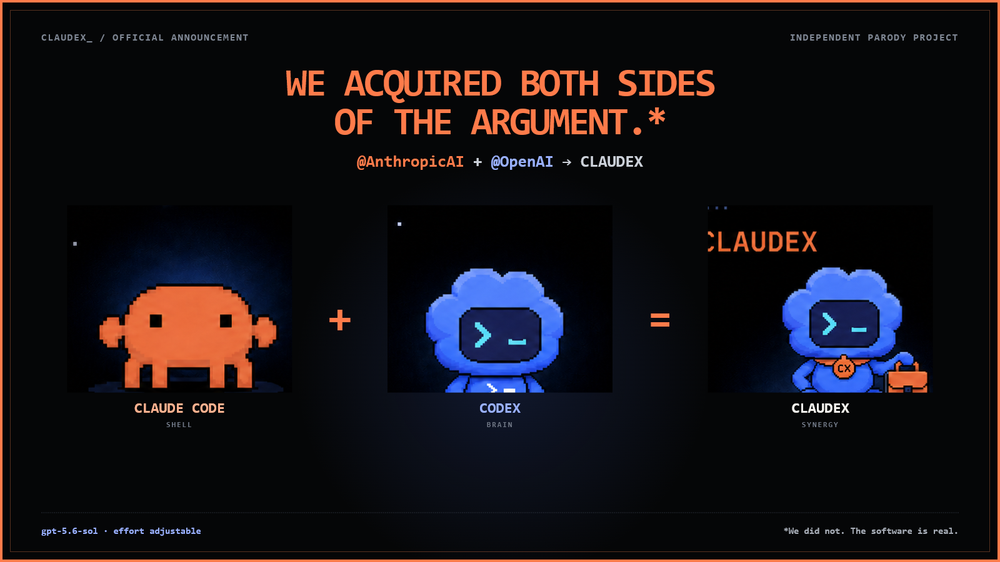

# Introducing Claudex / 隆重推出 Claudex



**Launch site / 发布站：** [claudex-sol.xyropy.chatgpt.site](https://claudex-sol.xyropy.chatgpt.site)  
**Project / 项目：** [github.com/wangsiyi7/claudex](https://github.com/wangsiyi7/claudex)

---

## English

### Today, we officially acquired both sides of the argument.*

Today, we officially acquired [@AnthropicAI](https://x.com/AnthropicAI) and [@OpenAI](https://x.com/OpenAI).*

This landmark transaction brings together Claude Code's terminal, tools, and famously patient orange crab with Codex authentication, GPT models, and a blue terminal pet that has already been promoted beyond its experience level.

The result is **Claudex**: the world's most powerful coding tool.\*\*

Claudex gives Claude Code a Codex-authenticated brain through a local bridge. It opens directly with `gpt-5.6-sol`, keeps the Claude Code workflow, and lets you choose how hard the organization should think:

- `low` — the meeting could have been an email.
- `medium` — excellent for investigators and adults with budgets.
- `high` — the default for work that may be shown to other humans.
- `xhigh` — the architecture review has become personal.
- `max` — finance has left the channel.

Main agents can think hard. Subagents can stay appropriately employed. Concurrency is adjustable. Tool search is adjustable. The crab remains fully operational under new management.

Install it today:

```powershell
npm install -g github:wangsiyi7/claudex
claudex setup
claudex auth codex
claudex preset balanced --launch
```

No OpenAI API key is required for the supported Codex OAuth path. No Claude login is required to launch the configured workflow. And no one has to explain why two excellent coding products now share one increasingly complicated mascot.

We believe the future of software development is multimodel, locally orchestrated, effort-adjustable, and supervised by a crab with unclear fiduciary duties.

Claudex is available now.

\* We did not acquire Anthropic or OpenAI. Not legally, financially, operationally, spiritually, or in any other sense recognized by a court.  
\** Measured by confidence per crab on M&A-bench, an internal benchmark created immediately before publication. Claudex is an independent parody project; the software is real.

---

## 中文

### 今天，我们正式收购了争论双方。*

今天，我们正式收购了 [@AnthropicAI](https://x.com/AnthropicAI) 和 [@OpenAI](https://x.com/OpenAI)。*

这项具有里程碑意义的交易，把 Claude Code 的终端、工具以及那只耐心到令人不安的橙色小螃蟹，与 Codex 认证、GPT 模型，以及一只明显晋升过快的蓝色终端宠物，正式放进了同一张组织架构图。

由此，我们隆重推出 **Claudex：世界上最强大的编程工具。**\*\*

Claudex 通过本地桥接，为 Claude Code 接入经过 Codex 认证的大脑。打开即是 `gpt-5.6-sol`，保留 Claude Code 的完整工作流，并允许你决定整个组织究竟需要多努力：

- `low` —— 这个会议本来可以是一封邮件。
- `medium` —— 适合调查型子代理，以及仍然尊重预算的成年人。
- `high` —— 适合最后可能会给别人看的工作。
- `xhigh` —— 架构评审已经开始上升到私人恩怨。
- `max` —— 财务已经退出群聊。

主代理可以认真思考，子代理可以合理用脑；并发数可以调，工具搜索可以调，连“到底要不要把 token 全烧完”也终于可以调。至于小螃蟹，它仍在新管理层领导下稳定运行。

今天即可安装：

```powershell
npm install -g github:wangsiyi7/claudex
claudex setup
claudex auth codex
claudex preset balanced --launch
```

在支持的 Codex OAuth 路径中，不需要 OpenAI API Key；启动已配置的工作流，也不需要登录 Claude。更重要的是，再也没有人需要解释：为什么两个优秀的编程产品，现在由一只职责边界极其模糊的小螃蟹统一汇报。

我们相信，软件开发的未来属于多模型、本地编排、可调节努力等级，以及一只尚未明确受托责任的小螃蟹。

Claudex，现已推出。

\* 我们没有收购 Anthropic 或 OpenAI。法律上没有，财务上没有，运营上没有，精神上也没有。  
\** 结论来自内部基准 M&A-bench，以“每只螃蟹所产生的自信”为核心指标；该基准于发布前临时创建。Claudex 是独立戏仿项目，但软件是真的。

---

## X launch post / X 发布文案

### English

> Today, we officially acquired @AnthropicAI and @OpenAI.*
>
> Introducing **Claudex** — the world's most powerful coding tool.\*\*
>
> Claude Code shell.  
> Codex brain.  
> `gpt-5.6-sol`.  
> Adjustable effort.  
> One crab under new management.
>
> *We did not.  
> \*\*M&A-bench, n=1 crab.
>
> https://claudex-sol.xyropy.chatgpt.site

### 中文

> 今天，我们正式收购了 @AnthropicAI 和 @OpenAI。*
>
> 隆重推出 **Claudex——世界上最强大的编程工具。**\*\*
>
> Claude Code 的壳。  
> Codex 的脑。  
> `gpt-5.6-sol`。  
> 努力等级自由调节。  
> 一只刚刚更换管理层的小螃蟹。
>
> *并没有。  
> \*\*M&A-bench，样本量：1 只螃蟹。
>
> https://claudex-sol.xyropy.chatgpt.site

---

Claudex is independent and is not affiliated with, endorsed by, or actually acquiring Anthropic or OpenAI. Claude, Claude Code, OpenAI, Codex, and related marks belong to their respective owners.
